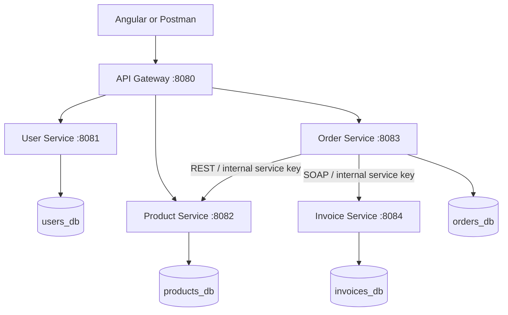
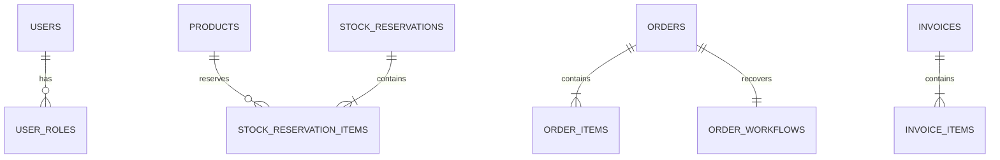

# Objective

Implement a Java Spring e-commerce backend demonstrating REST, SOAP, Spring Data JPA, transactions, AOP logging, validation, exception handling and microservice communication. Support administrators managing products, sellers maintaining their listings, and customers placing orders and obtaining bills.

## System architecture

Each service is an independent executable jar. Its database is private by architectural convention. Cross-service IDs are stored without cross-database foreign keys. Gateway routing does not replace service-side security.

## Entity relationships

`Product.sellerId` references a user by identity only. `Order.buyerId` similarly identifies a buyer. Order and invoice items store product and seller IDs plus immutable names, quantities and purchase prices. Invoice.orderId is unique. Orders are unique by `(buyerId, idempotencyKey)`.

## Checkout and recovery

1. In a local serializable transaction, persist a PENDING order, requested items, request hash, and workflow.
2. Claim the workflow using a database-backed 90-second lease. This prevents simultaneous request and recovery workers from normally executing it together.
3. Call Product Service outside the order database transaction. Reserve every requested product atomically, locking products in ID order. Product Service records a price snapshot and the request hash.
4. Save the snapshot and total locally. If this fails temporarily, retain the reservation and retry later; do not guess whether another service rolled back.
5. Confirm the reservation. Confirmation decrements physical stock and releases the reservation count in one local transaction.
6. Mark the order CONFIRMED and the workflow DONE. A crash after stock confirmation is recovered by retrieving the already-confirmed reservation.

Repeated remote operations return the existing state. Conflicting input under an existing identity is rejected. A reservation rejected for unavailable products is checked again before the order is marked FAILED. Network errors and authentication/configuration failures keep the order PENDING for recovery instead of silently discarding it.

Recovery scans up to 20 eligible workflows every 15 seconds. Failed work uses bounded backoff up to 300 seconds. Retries continue so outages do not silently abandon stock. Pending orders and `.local/order-service.log` expose unresolved work. Requests can also resume their own existing workflow.

## Stock lifecycle

| Transition | stock_on_hand | reserved |
|---|---:|---:|
| Reserve Q | unchanged | +Q |
| Confirm Q | -Q | -Q |
| Release unconfirmed Q | unchanged | -Q |
| Cancel confirmed Q | +Q | unchanged |

Availability is stock_on_hand minus reserved. The database enforces nonnegative values and reserved <= stock_on_hand. The stock adjustment API rejects values below active reservations. It sets current stock on hand, not a delta.

Cancellation is compensation for a confirmed purchase: record CANCEL_PENDING, restore inventory once via Product Service, then mark CANCELLED. Invoice generation and cancellation lock the same order row to serialize their eligibility checks. Invoice generation sets a durable flag before making the SOAP call, preventing a concurrent cancellation from restoring stock for an invoiced order.

## Transaction boundaries

`Transactions` uses Spring TransactionTemplate with REQUIRES_NEW and SERIALIZABLE; each call is a local database transaction. SQLSTATE 40001 is retried up to four times after the first attempt, with exponential backoff and jitter. HTTP/SOAP calls are never inside these callbacks. No claim is made that a local Spring transaction atomically commits all microservices.

## Security and operations

JWT issuer, signature, and expiry are validated independently in each business service. Roles are generated from stored user roles; registration cannot choose ADMIN. Passwords use BCrypt. The gateway removes client-supplied internal service keys. Internal routes require a separate service credential. Shared HMAC keys are suitable for this academic deployment; asymmetric keys and distinct service identities would be a production improvement.

AOP records operation, elapsed time, outcome, and trace ID without request contents. REST errors carry a consistent code/message/fields/traceId shape; SOAP contract errors produce SOAP faults. Health endpoints reveal only status. Flyway migrations own schema evolution. Product deactivation and immutable order/invoice snapshots preserve history.

## Sources consulted

- [Spring Boot Java compatibility](https://docs.spring.io/spring-boot/3.5/system-requirements.html)
- [Spring Cloud compatibility](https://spring.io/projects/spring-cloud/)
- [CockroachDB transaction guidance](https://www.cockroachlabs.com/docs/stable/developer-basics.html)
- [PostgreSQL JDBC SSL configuration](https://jdbc.postgresql.org/documentation/ssl/)
